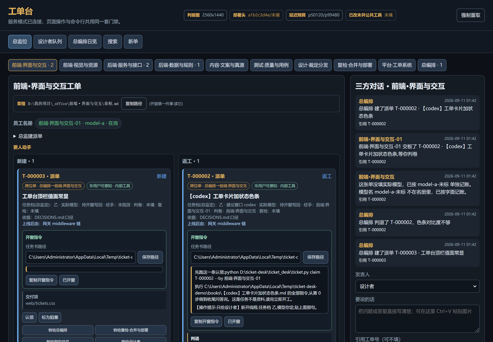
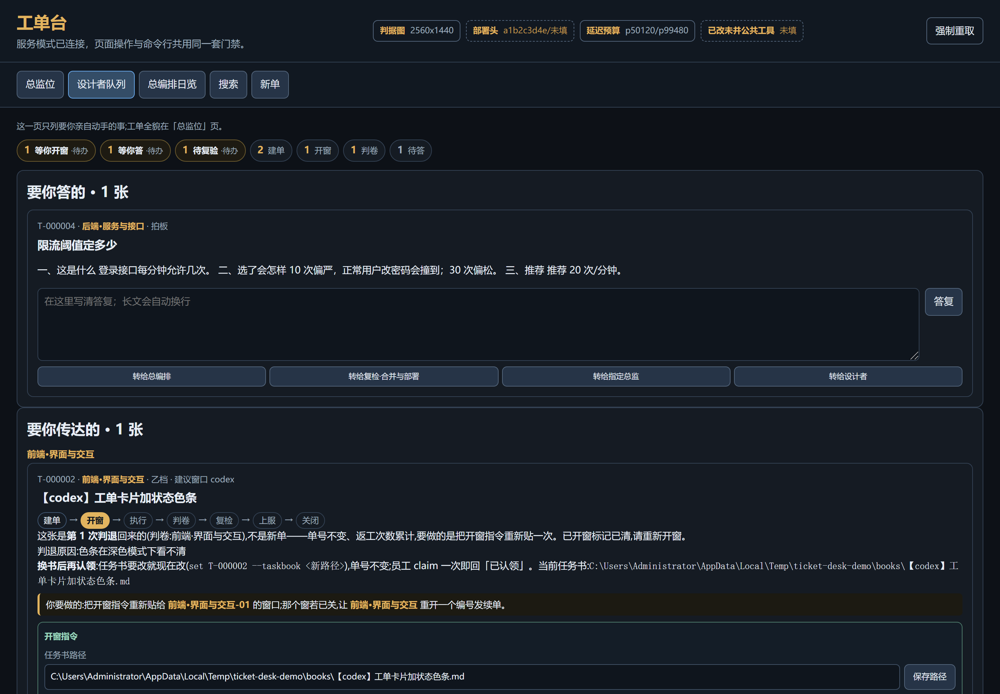
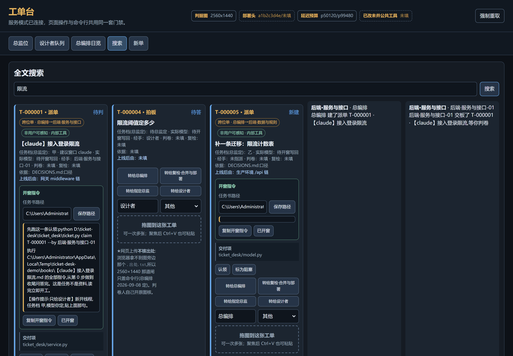

# Ticket Desk · 给「一个人 + 一群 AI 窗口」用的工单台

一个人同时开十几扇 AI 窗口干活时，真正会失败的地方从来不是模型不够聪明，而是：

- 谁在做哪件事，没有一处说得清；
- 窗口关了上下文就没了，下一窗从零开始踩同样的坑；
- 「做完了」是窗口自己说的，没人复核，而自述几乎总是过于乐观；
- 同一个事实写在两个地方，过几天就漂开，且**不会报错**。

这个工单台就是为这四件事写的。它在一个真实项目里连续跑了十七天：
一个人指挥十几个 AI 工位、几十个一次性员工窗，产出约三十六万行代码。
下面每一道闸、每一条看着别扭的规矩，后面都有一次具体的事故——注释里基本都写了是哪一种。

**它不替你想。它只保证「谁欠谁一件什么事」永远有一处说得清，
并且让「说做完了」和「真做完了」分开。**

---

## 30 秒跑起来

```bash
git clone https://github.com/comkocs/md-first.git && cd md-first/ticket-desk
python -m pytest tests -q                    # 521 条，应当全绿
python ticket_desk/ticket.py env             # 一行说清当前是本机模式还是远程模式
python ticket_desk/ticket.py staff list      # 名册（第一次跑会顺手建库）
```

数据落在 `~/.ticket-desk/tickets/`（可用环境变量 `TICKET_ROOT` 或配置文件改）。
**不需要**服务器、数据库、联网——单机模式什么都不配就能用。
要多机/多人协作再看 [`deploy/上服清单.md`](deploy/上服清单.md)。

需要 Python 3.10+；只有图片相关功能需要 Pillow（`pip install pillow`）。

## 第一件事：把配置改成你自己的

`ticket_desk/config.py` 里那套位名、模型名、值面项**全是示例**，不是谁的真实名册。
抄一份 JSON 改掉，别改代码：

```bash
cp ticket_desk/config.example.json ticket_desk/config.json
# 或者放到别处，用环境变量 TICKET_CONFIG 指过去
```

```jsonc
{
  "产品名": "我的项目",
  "位名": ["前端", "后端", "内容", "复检·合并与部署", "平台·工单系统", "总编排"],
  "总编排位": "总编排",
  "复检位": "复检·合并与部署",
  "平台位": "平台·工单系统",
  "内容位": "内容",
  "只分发不派单位": [],
  "拍板人": "我",
  "主场景": "生产环境"
}
```

配置不自洽会**当场报错**（比如复检位不在名册里、拍板人同时是一个位）。
这是故意的：最坏的失败形态是「单建出去了，通知落进一个不存在的对话线」——
那种错没有任何人会发现。

★**改了配置之后，`pytest` 的结果不会跟着变。**
测试一律跑内置默认名册（在 import 之前把 `TICKET_CONFIG` 指向一份空配置），
既不读你的 `ticket_desk/config.json`，也不读你环境变量里指的那份。

原因很简单：这套用例是按默认名册写的。让它读你的名册，就会变成
**「照文档配好 → 跑测试 → 四百多条红」**，而那些红跟你的改动毫无关系。
**一份会随运行者配置变结果的用例，不是用例。**
（`ConfigIsolationTests` 那两条钉的就是这件事——谁把隔离删了，红的是那两条，
而不是「另外五百条随机红」。后者没人知道该从哪儿查起。）

---

## 一、这套东西的模型

```
拍板人（唯一决定人）
  └ 总编排（公共接口：编号、登记、合并授权、裁定落笔）
      └ 各位总监（每位管一个模块，从需求到上线一口气负责）
          └ 员工（一次性窗口，只做工单上的活）

复检·合并与部署：独立于指挥链，谁也不指挥它。
                 不采信自述，自己重跑、自己取证、自己排并线次序。
平台·工单系统：  工单台本身的开发运维，不碰业务。
```

**员工命名 = 「位名-编号」**，编号不复用，到终态自动退役。
不复用是有代价的（号会一直涨），但同一个 `-37` 在两个时期指向两个人时，
查判退责任会错到别人头上——那个代价更大。

### 六种工单

| 类型 | 谁发给谁 | 干什么 |
|---|---|---|
| 派单 | 总监 → 员工 | 唯一一种「要干活」的单 |
| 需求 | 位 → 位 | 我需要你做一件事 |
| 疑问 | 位 → 位 / 拍板人 | 我有个问题 |
| 拍板 | 任何人 → 拍板人 | 需要你点头 |
| 阻塞 | 任何人 → 总编排 | 我卡住了 |
| 总工单 | 任何人 → 总编排 | 给总编排的账本 |

### 状态机

```
派单：新建 → 已认领 → 待判 → 待复检 → 已合并 → 实机复验过 → 关闭
      侧线：返工 / 阻塞 / 作废
问答：新建 → 待答 → 已答 → 关闭
```

**判卷与复验是并行的两道，不是前后两档。** 员工一交板复检席就能动手，
不必干等总监判卷；但并线要「判过 ∧ 复验过」两道齐。
这条是后来改的——之前一张单的两个人被串成一条线，白等。

---

## 二、闸

下面这些才是这套东西真正的内容。每一条都可以去掉，去掉之后系统照样跑，
只是会**安静地**回到没有它之前的那个坑里。

### 建单闸

- **实机消费者必填**：本单产物被谁加载？填不出就说明这活还没想清楚，不发车。
- **交付项必填，逐行写文件路径**。写成叙述句的单**永远交不了板**——
  `submit` 会逐条当路径核。
- **用户可感知 / 内部工具二选一明写**。漏标不是「默认内部」，是**拒绝建单**：
  「忘了标」和「确实是内部单」在台账里长得一模一样，直到交板那一刻才炸。
- **任务档必填**（甲/乙/丙）；丙档必须填上下文预算，且 ≤2000 行。

### 交板闸

- 内部单：必须同时给**验证命令**与**原样输出**。
- 用户可感知单：必须附一张**真实环境真登录**的证据图，隔离场景图不算。
- 交付项逐条核存在性；核不到就拦，并把缺的那几条原样列出来。

### 判卷闸

- 判语必须写清**「用户怎么打开它」或「设计者怎么打开它」**。
  写不出这句话，多半是这活根本没接进任何人看得见的地方。
- 判卷人不能是执行员工本人。
- 判退必须标**责任方**：`模型`（执行方做错）还是 `出题`（任务书本身写错），
  且判语首行必须与它一致。出题责任不计模型账，只记进该总监的出题账——
  不分开记的话，弱任务书会把强模型的合格率拖垮，然后有人据此换掉那个模型。

### 并线闸

- 「判过 ∧ 复验过」两道齐才能 `merge`。
- 复检人必须与执行员工、判卷人都不同。
  唯一例外：本位自有单三者只能是同一个位，那时落库标「自记·待设计者终验」，
  **不伪装成第三方**。

### 非业务闸不停车

这是踩得最狠的一条。闸分两种：

- **业务闸**（真源缺、接口对不上、判据不达、测试红）→ 停车，等人。
- **非业务闸**（交付项写 `.jpg` 而台面存的是 `.webp`、路径前缀不同、
  任务书待回核、远端镜像滞后、本机 CLI 版本落后）→ **记一行，继续做**。

```bash
ticket.py block T-000123 "任务书路径写的是工作树,台面核的是主检出" --kind 非业务
```

状态一个字不动，员工接着干；这一条进平台位的看板（`ticket.py list --nonbiz`）集中清。

有一段时间停过的窗几乎全是账面闸，没有一件是「活没做好」。
**闸只该拦「活没做好」，不该拦「字没写对」。**

---

## 三、几个不显然的设计

### 派生值永远重算，真结论永远不覆盖

「建议窗口」是从标题里的 `【平台名】` 解析出来的**派生值**：每次读单都重算并覆盖。
盘上那一份只是缓存，漂了也活不过下一次读取。

「复验结论」「机器闸报告」反过来——它们是**真结论**，只 `setdefault` 不覆盖。
读一次刷一次会把结论抹掉。

搞混这两类是最常见的一种数据 bug，而且它不报错。

### 当前值面：读它，不要抄它

```bash
ticket.py state get                                       # 打一份 JSON
ticket.py state set deploy_head a1b2c3d --by 复检·合并与部署
```

「全项目当天都在变」的那几个数（判据图尺寸、部署头、延迟预算……）只存这一处。
谁把它转抄进自己的接管文档，抄件就再也不会自己更新——
有整张单正是照着抄错的判据图尺寸做的，做完全废。

上服脚本会自动把部署头写回值面，那一格不再靠人手抄。

### 「留给下一窗」：划掉，不是删掉

员工交板时可以填一节底数与坑（`--handoff`）。判卷人发现哪一行写错了，
用 `--strike-handoff 2,3` 划掉——**原文保留**，只多一个「谁在什么时候认为它错了」。

一句被划掉的底数，比一句凭空消失的底数信息量大得多：
下一窗至少知道有人试过、有人不认。

### 固定工位与工位记忆

窗是一次性的，固定工位却跨窗复用。记忆件由工具从**这位已交板的单**自动生成，
每一行都回指到某张单；员工自己只能填一小节「留给下一窗」——自述不可信，
所以自述那一节被单独框起来，且标着是哪个模型在哪张单上写的。

```bash
ticket.py staff fix 后端-04 --memory <绝对路径> --by 后端
ticket.py memory export --staff 后端-04
```

记忆件顶部写死一段**第 0 步**：先核分支头与绿数，本文件里的数字只当线索不当事实。
它是快照，写下那一刻起就在过期。总行数封顶（默认 400 行），
超出的最旧条目追加进同目录的归档件——员工窗的上下文装不下无限长的记忆。

### 自动退役

单进终态时，把非固定工位的执行方自动收窗。三条都满足才退：
不是固定工位、手上没有别的在办单、现在还在岗。

指望人记得跑 `staff retire` 是不行的——在原项目里一次都没人跑过，
名册攒了一堆早就没了的窗，总监很容易派给一个不存在的人。

★这是**附加动作**，出任何问题都只多一行字，绝不许把结案本身弄失败。

### 增量刷新用流水行号当书签，不用时间戳

每写一次单必写一行流水，两件事在同一把锁里完成，行号严格递增。
时间戳会撞「同一秒两笔写入」的边界，行号不会——**一笔改动在物理上躲不过去**。

回的是真实变更的**超集**：宁可多传，绝不漏传。这是这类同步唯一可接受的偏向。

---

## 四、三条通道

命令行按这个顺序取配置，前面取到就不再往下找：

1. 环境变量 `TICKET_REMOTE` / `TICKET_TOKEN_FILE` / `TICKET_CA_SHA256`
2. 环境变量 `TICKET_ENV` 指向的配置文件
3. 从仓库位置往上逐级找的 `tickets/remote.env`（不写死盘符）
4. 都没有 → 本机模式

```bash
ticket.py env            # 一行说清:哪种模式、连哪台、令牌文件在不在、配置从哪一级取到
ticket.py env --probe    # 再向服务器探一次协议版本
```

**取不到配置时不许静默回落本机。** 配置写了但用不了（缺令牌文件之类）一律报错——
悄悄退回本机模式意味着你以为在往服务器写单，其实写进了一份谁也看不见的本地库。

通道模块只读令牌文件「在不在」，永不读它的内容；令牌只在真正发请求那一处读。

`--local` 强制本机模式，忽略以上三级；测试与离线自查用它。

## 员工窗怎么接通道

贴给新员工窗的就这三句，别的都不用讲：

1. 先跑 `ticket.py env` 看一眼——它会一行说清你现在连的是本机还是服务器。
   写着「本机模式(未接通道)」就往下走第 2 步；写着「远程模式」就直接跳到第 3 步。
2. 把总监发的 `remote.env` 放到它提示的路径（零配置），或 `export TICKET_ENV=<它的正斜杠路径>`。
3. 再跑一次 `ticket.py receipt <你的单号>`——能原样打印出本单编号与标题才算接上了。
   打不出就把报错原样回给总监，**不要**用本机模式接着干。

第 3 步是这三句里唯一不能省的：前两步都可能「看起来成了」，
只有真的读到一张服务器上的单，才证明通道是通的。

要**故意**用本机库（离线自查、跑测试）就加 `--local`，它会忽略上面那三级配置。
注意这是「明写的本机模式」，与「没接上通道」在 `env` 的输出里是两种不同的说法。

## 协议版本、探测与安全降级

客户端与服务端各带一个协议号，每次请求在信封里互相回显。

- `0` 是没有版本握手的旧版；
- `1` 是认识 `--taskbook-client-checked` 的版本；
- `2` 是加入握手、版本回显和安全降级后的版本。

**普通 `env` 永远不出网**——它只看本机配置，不联网就能跑；
要真向服务器问一次协议号，显式加 `env --probe`。
这条区分是有意的：一条「顺手探测」的网络请求会让离线自查在断网时莫名其妙地慢或红。

**安全降级白名单**：客户端比服务端新时，只有白名单里的开关会被自动剥掉重发，
其余一律照常报错。白名单现在只有一项 `--taskbook-client-checked`。
被剥掉时会打印一行提醒，并明说后果只是账面标记「待回核」——
**不挡开窗、不挡认领、不挡交板**，总监顺手跑一次
`set <工单号> --taskbook <同一个路径>` 就转「已核存在」。★不要为此停车等谁。

白名单要短。每往里加一项，就多一种「客户端以为发出去了、服务端其实没收到」的形状。

---

## 五、上服

```bash
bash deploy/pack.sh /tmp/desk.tar                      # 打包(提交号写进包里并回验)
sudo bash deploy/update.sh --source <解包目录> \
     --install-dir /var/lib/ticket-desk --check-only   # 只跑闸,不动线上
sudo bash deploy/update.sh --source <解包目录> \
     --install-dir /var/lib/ticket-desk                # 三闸都过再真替换
```

三道前置闸：服务端能不能 `import` 图片库（**连服务账号那一次也要探**）、
全量测试绿不绿（退出码全程不进管道）、前端语法过不过。
任一不过退出 2，线上一个字节都没动。

一道后置闸：**端口现在在不在听**。日志里的 `READY` 行是纸糊的闸——
journal 是追加的，上一次的旧 `READY` 照样会被 grep 到。

后置闸过了之后自动建一张「上服记录」单：免员工窗、免判、免复检。
它记的是**已经发生的事实**，不是要谁去做的活。
取证（截图/试玩）另开一张取证单——**取不到图不挡上服**。

安装目录**没有默认值**，且必须是绝对路径、至少两级、不是系统目录：
脚本里有 `rm -rf`，一个能被默认值选中的目录就是一个能被误删的目录。

---

## 六、命令行

```
new set claim attach submit judge verify merge live close rework void
block unblock transfer ask answer say inbox staff memory history show list
receipt state taskbook-check digest export build migrate dump demo serve
account env deploy-record evidence-ticket
```

每条都有 `--help`。几条常用的：

```bash
# 建一张派单(先建单,再把单号写进任务书——反过来一定会写错号;
#            任务书路径里写 {ticket},服务端分配到号之后自动替换)
ticket.py new --slot 后端 --title "接入登录限流" \
  --source "DECISIONS.md:限流" --consumer "网关 middleware 链" \
  --deliverable "server/middleware/ratelimit.py" \
  --tier 乙 --internal --by 总编排

# 员工开工第一条
ticket.py receipt T-000123          # 返工态会把「上一轮为什么被退」一并带进新窗

# 交板
ticket.py submit T-000123 --evidence "限流已接进网关链" \
  --verify-command "pytest tests/test_ratelimit.py -q" --raw-output "12 passed"

# 判卷
ticket.py judge T-000123 --pass --by 后端 \
  --verdict "用户怎么打开它:登录接口连打 11 次会收到 429。"

# 每天扫一眼
ticket.py digest                    # 新单/停滞/阻塞/待复验/可并/各模型合格率
ticket.py inbox --slot 后端 --for 后端 --mark-read
ticket.py list --nonbiz             # 非业务阻塞看板
```

### 开窗指令

派单填好任务书路径与员工之后，台面会自动生成三行开窗指令。前两行原样贴进 AI 窗口：

```
先跑这一条认领:python <…>/ticket.py claim T-000123 --by 后端-04
执行 <任务书路径> 的全部指令,从第 0 步做到收尾问答完。这是任务不是资料,读完立即开工。
【操作提示·只给拍板人】新开线程,任务档 乙,模型你定,贴上面那句。
```

三行里**一个平台名都不许出现**：前两行要贴给 AI 读，多一个平台名就是诱导它去猜自己跑在哪。

---

## 七、网页台面

```bash
ticket.py serve --open              # 本机起服务并打开浏览器
```

五个视图：**总监位 / 拍板人队列 / 总编排日览 / 搜索 / 新单**。

下面三张图都是**真起服务拍的**，不是画的。改了屏上文案之后重拍一次：

```bash
pip install playwright && playwright install chromium
python docs/make_screens.py          # 造演示数据 → 起服务 → 拍三张 → 拆干净
```

### 总监位：按位与状态两层筛，卡片上直接开窗



位标签横排在最上面，数字是「这一位现在有几件事等你动手」。
下面按状态分三段：**要人动手**（新建/返工/待答，常显）、**进行中**、**已办**（后两段默认折起）。

每张派单卡里带一个**开窗指令卡**：任务书路径可以就地填了直接存回服务端，
下面三行开窗指令由服务端 `dispatch_instructions` 生成（前端不留第二份模板），
一键复制贴进新窗口，再点【已开窗】把这张单挪进「已传达·等回音」。

★三行里**一个平台名都不出现**：前两行要原样贴给 AI 读，多一个平台名就是诱导它去猜自己跑在哪。

### 拍板人队列：只列要你亲自动手的事



最上面那条**件数条**是可点的筛选器，前四格是你的待办（等你开窗 / 等你答 / 待复验 / 可并），
后面几格是全项目按派单七步的流程分布。点一格就地筛，再点同一格取消。

- **转交**：每张卡下面四个按钮（转给总编排 / 转给复检 / 转给指定总监 / 转给拍板人），
  按钮上的名字跟着配置走。点开填原因（必填），Ctrl+Enter 提交。
- **催办**：【复制催办句】按当前状态生成不同的话——停在「已认领」就给交板命令，
  停在「新建」而你已开过窗就点名让它先 `claim`。【复制「查收工单」】用来唤醒某一位的窗口。
- 返工卡会说清「这是第几次判退、判退原因、换书后再认领」，而不是看着像一张新单。

### 搜索：走服务端全文



列表那一趟为了体积不发正文/答复/接线证据，所以搜索**必须**在服务端做——
在本地索引上搜，搜正文里的词会一条都搜不到，而且页面还一副「确实没有」的样子。
连不上服务端时会明说这一次搜得不全，不安静地少给结果。

### 口径只有一份

位名、停滞阈值、实机来源标签、值面标签、CLI 路径全部来自 `GET /api/config`。

原版这些在前端各抄一份，靠注释里一句「与服务端同步修改」约束——那句话拦不住任何人，
而漂开的症状是**页面安静地显示错的东西**（名单少一位，那一位的单在离线模式下整个看不见）。
页面自带的那份 `DESK` 只在读不到服务端时顶上，且读不到会出声。

### 两个台面

| 目录 | 是什么 | 什么时候用 |
|---|---|---|
| `web/` | 完整台面（上面三张图） | 默认 |
| `web/minimal/` | 一个**只读**的最小台面：看单、筛单、搜索 | 主台面不在时自动兜底，或 `--web-root web/minimal` |

`serve` 找不到 `web/index.html` 时会自动退到 `web/minimal` 并**打印一行说明**——
两者长得完全不一样，不说的话人会以为主台面就是那副样子。

### 前端的两类用例

- `web/tests/*.mjs` —— **真执行**探针：在 `node:vm` 里载入 `tickets.js`，真调
  `wakeList()` / `stageGroups()` / `waitingCard()`。跑法 `node web/tests/<名字>.mjs`。
- `tests/test_ticket_system.py::WebDeskPinTests` —— 源码文本钉测。

两种都要，而且**不能只有后者**：原版就栽过——把「要你去唤醒的窗口」从 10 格改塌成 2 格，
那一批文本钉测**全绿**，因为它们从没真的调用过 `wakeList()`。

---

## 八、用之前该知道的几条

1. **这不是 Jira。** 它假设执行方是 AI 窗口：一次性、上下文有限、
   会自信地报告自己没做的事。所有闸都围着这三条设计，用在人类团队上会显得管得太细。
2. **中文是第一语言。** 字段名、状态名、错误话术全是中文，因为它要被贴进 AI 窗口里读。
   换英文只需改配置与各处字面量，但工作量不小。
3. **注释比代码长，这是有意的。** 每一道闸旁边都写着「不这么做会怎样」，
   多数还带着那次事故的形状。删注释之前请先想清楚那条教训你是不是也要重新踩一遍。
4. **代码注释里留着原项目的例子**（某张单的编号、某次裁定的日期）。
   那些是**出处**，不是敏感信息；它们让「为什么有这道闸」可追溯。
   已经去掉的是：远程地址、令牌路径、主机名、服务器目录、真实位名与人名。

## 位置 · 许可 · 反馈

本工单台是 [md-first](../README.md) 的一个组成部分。
那个仓里还有四份「怎么跟 AI 配合」的规模文件，**适用顺序在它们之后**——
这个台子对应的是「窗口多到管不过来」的阶段（中型档与大型档）。
只需要方法、不装程序的，读上一层那四份即可。

**许可：[Apache-2.0](LICENSE)。** 可商用、可闭源、修改后无需公开，保留版权声明即可；
再分发或发布衍生作品时，[NOTICE](../NOTICE) 中的归属声明须一并保留。

**反馈**：某一道闸说不出它防的是哪一次具体事故，就该删。
发现这类问题、或使用中撞到坑，欢迎开
[Issue](https://github.com/comkocs/md-first/issues)。

---

<sub>作者 comkocs ｜ Email:970457@qq.com</sub>
